# delta-iceberg-performance-lab


## 1. Contexte du projet
Les architectures de données modernes ont évolué des Data Lakes traditionnels vers le paradigme du Lakehouse.
Aujourd'hui, un système Big Data ne se contente plus de stocker des fichiers passifs ; il doit gérer :
- De très grands volumes de données avec des écritures fréquentes (ingestion en continu ou par lots).
- Des lectures analytiques complexes et performantes.
- Des modifications granulaires (mises à jour, suppressions) imposées par la réglementation (ex: RGPD).
- L'évolution dynamique des schémas de données (Schema Evolution).
- Des besoins de traçabilité, d'isolation (transactions ACID) et de versioning.
- La prolifération du nombre de fichiers (le problème des small files).

Historiquement, des formats de fichiers physiques comme Parquet ou ORC étaient utilisés. S'ils sont excellents pour la compression et la lecture en colonnes, ils deviennent insuffisants lorsqu'il s'agit de modifier une seule ligne ou d'assurer la cohérence lors d'écritures concurrentes. C'est ici qu'interviennent les Table Formats modernes, tels que Delta Lake et Apache Iceberg. Ils apportent une couche de gestion abstraite au-dessus des fichiers physiques pour offrir des transactions ACID, la gestion fine des métadonnées, le time travel, et l'optimisation des requêtes.

## 2. Problématique
Face à l'adoption massive de ces technologies, le choix entre Delta Lake et Apache Iceberg est souvent dicté par des préférences d'écosystème plutôt que par des métriques objectives. La problématique centrale de ce projet est donc la suivante :

**Problématique de recherche expérimentale**
> « Pour un même volume de données, avec le même moteur de calcul, les mêmes ressources matérielles et les mêmes opérations, quelles différences de performance et de comportement peut-on observer entre Delta Lake et Apache Iceberg ? »

Il est crucial de souligner que l'objectif n'est pas de déterminer de manière absolue si « Delta est meilleur qu'Iceberg » ou inversement. Le but est d'identifier de manière empirique : Dans quelles conditions, sur quelles volumétries et pour quelles opérations spécifiques l'un de ces formats présente-t-il des caractéristiques plus avantageuses que l'autre ?

## 3. Objectif général
L'objectif général est de concevoir, déployer et exécuter un benchmark expérimental rigoureusement contrôlé.
Pour garantir une comparaison scientifique et équitable, l'expérience doit neutraliser les variables externes. Le benchmark sera donc exécuté en garantissant la stricte égalité des éléments suivants :
- **Moteur de calcul** : Apache Spark (même version, même configuration).
- **Données** : Les mêmes datasets générés.
- **Infrastructure** : Les mêmes ressources matérielles (CPU, RAM, disques).
- **Stockage** : Le même environnement de stockage distribué ou objet.

## 4. Attention : Que mesure-t-on réellement ?
Il est fondamental de comprendre l'anatomie d'une requête dans notre architecture. Lorsque l'on chronomètre une opération (ex: `SELECT` ou `UPDATE`), le temps mesuré n'est pas uniquement « le temps de Delta » ou « le temps d'Iceberg », mais inclut également le temps d'exécution du moteur de calcul (Spark) et les accès au stockage sous-jacent.

## 5. Ingestion des données
L'ingestion des données constitue une phase clé de l'évaluation de performance. Dans le cadre de ce projet, nous allons mesurer et comparer :
- **Le temps d'écriture initial (Bulk Insert)** : Création des tables et chargement massif des données.
- **Les écritures incrémentales (Append)** : Ajout régulier de nouveaux lots de données.
- **L'impact de la taille des fichiers (Small files)** : Comment chaque format gère l'ingestion de multiples petits fichiers et l'optimisation ultérieure (ex: bin-packing, compaction).

## 6. C'est quoi Delta Lake ?
Delta Lake est un format de table open-source développé par Databricks qui apporte fiabilité, performances et sécurité aux Data Lakes. Il ajoute une couche de transaction au-dessus du stockage cloud (ou HDFS) et se base principalement sur des fichiers au format Parquet. Ses caractéristiques clés sont :
- Transactions ACID complètes pour garantir la cohérence des données.
- Gestion scalable des métadonnées (via un log transactionnel `_delta_log`).
- Prise en charge native de l'évolution des schémas (Schema Evolution & Enforcement).
- *Time Travel* permettant d'accéder à l'historique des données pour des retours en arrière ou de l'audit.

## 7. C'est quoi Apache Iceberg ?
Apache Iceberg est un format de table ouvert, initialement créé par Netflix, conçu pour gérer d'énormes volumes de données (pétaoctets) et répondre aux limitations de l'écosystème Hadoop (comme Hive). Iceberg se détache du modèle basé sur les dossiers en gérant les tables au niveau des fichiers via une arborescence de métadonnées. Ses caractéristiques clés sont :
- Suivi fin des fichiers (via des manifests et manifest lists), évitant les lents "list" de répertoires du cloud.
- Évolution de schéma (Schema Evolution) complète (ajout, renommage, réordonnancement) sans réécriture de données cachées.
- Évolution du partitionnement (Partition Evolution) transparente pour les utilisateurs.
- Indépendance forte vis-à-vis des moteurs de calcul (Spark, Trino, Flink, etc.).


## 🚀 Lancement Rapide

Ouvrez un terminal dans le dossier `infrastructure` et lancez :

```bash
# Construire et lancer les conteneurs
sudo docker compose up --build -d

# Attendre que Spark soit prêt (quelques secondes)
sleep 10

# Soumettre le script d'ingestion (venv du conteneur requis pour boto3/pandas)
sudo docker exec -it -e PYSPARK_PYTHON=/opt/bitnami/spark/venv/bin/python3 \
    -e PYSPARK_DRIVER_PYTHON=/opt/bitnami/spark/venv/bin/python3 spark-master-lab \
    spark-submit /opt/bitnami/spark/jobs/ingestion.py

# Optionnel : Arrêter les conteneurs
sudo docker compose down
```

## 🔧 Architecture du Projet

```
delta-iceberg-performance-lab/
├── app.py                     # Application Streamlit (visualisation)
├── infrastructure/            # Configuration Docker
│   ├── docker-compose.yml     # Orchestration des 3 conteneurs
│   ├── Dockerfile             # Image Spark + Delta + Iceberg + S3
│   └── requirements.txt       # Dépendances Python
│
├── spark_jobs/                # Scripts Spark
│   ├── ingestion.py           # Chargement Delta + Iceberg (26,17 M lignes)
│   ├── benchmark.py           # Benchmark : READ / FILTER / AGG / UPDATE / DELETE
│   └── storage_analysis.py    # Métriques données vs métadonnées
│
├── data/
│   ├── source/*.parquet       # Données sources NYC Taxi
│   ├── benchmark_results.csv  # Résultats générés par benchmark.py
│   ├── storage_metrics.csv    # Résultats générés par storage_analysis.py
│   └── minio/                 # Stockage objet MinIO
│
└── imgs/
    └── *.png                  # Visualisations du rapport
```

## 🎯 Objectifs du Projet

### Objectif 1 : Ingestion et Comparaison
- [x] Ingestion des donnéesources vers MinIO
- [x] Sauvegarde au format Delta Lake
- [x] Sauvegarde au format Apache Iceberg
- [x] Mesure des temps d'écriture

### Objectif 2 : Requêtes et Benchmarks
- [x] Requêtes simples (lecture complète)
- [x] Agrégations complexes (GROUP BY + SUM)
- [x] Point de contrôle (Checkpoint) Delta Lake
- [x] Partitionnement Iceberg
- [x] Mesure des temps de lecture et calcul

### Objectif 3 : Analyse et Rapport
- [x] Génération de graphiques avec Matplotlib
- [x] Comparaison visuelle des performances
- [x] Export des résultats en HTML
- [x] Rédaction du rapport d'analyse

## 📋 Instructions Détaillées

### 1. Prérequis
- Docker et Docker Compose installés
- Permissions sudo pour Docker

### 2. Configuration de l'Environnement
```bash
cd infrastructure
sudo docker compose up -d
```

### 3. Exécution du Script Principal
```bash
sudo docker exec -it spark-master \
    spark-submit /opt/bitnami/spark/jobs/ingestion.py
```

### 4. Vérification des Données
Accédez à l'interface MinIO : http://localhost:9090
- Bucket : `deltavsicberg`
- Dossiers : `delta/` et `iceberg/`

### 5. Exécution du Benchmark (5 opérations, 3 runs, Delta vs Iceberg)
```bash
sudo docker exec -it spark-master-lab \
    spark-submit /opt/bitnami/spark/jobs/benchmark.py
```

> 💡 Spark doit utiliser le venv du conteneur (boto3/pandas) :
> ```bash
> sudo docker exec -it -e PYSPARK_PYTHON=/opt/bitnami/spark/venv/bin/python3 \
>     -e PYSPARK_DRIVER_PYTHON=/opt/bitnami/spark/venv/bin/python3 spark-master-lab \
>     spark-submit /opt/bitnami/spark/jobs/benchmark.py
> ```

### 6. Analyse du Stockage (données vs métadonnées)
```bash
sudo docker exec spark-master-lab \
    /opt/bitnami/spark/venv/bin/python3 /opt/bitnami/spark/jobs/storage_analysis.py
```

### 7. Visualisation (application Streamlit)
```bash
cd .. && .venv/bin/streamlit run app.py
# puis ouvrir http://localhost:8501
```

### 8. Nettoyage
```bash
sudo docker compose down
```

## 📊 Résultats du Benchmark

Benchmark exécuté sur le jeu de données **NYC Taxi (26 173 246 lignes)**, avec le **même moteur (Spark 3.5)**, **les mêmes données**, **le même stockage objet (MinIO/S3)**, cache vidé avant chaque mesure, **3 runs par opération**. Cinq opérations sont mesurées : lecture, filtre, agrégation, **UPDATE** et **DELETE**. L'application Streamlit (`app.py`) affiche pour chacune une explication de l'opération, la comparaison Delta vs Iceberg et le vainqueur.

### 1. Temps d'exécution moyen par Opération
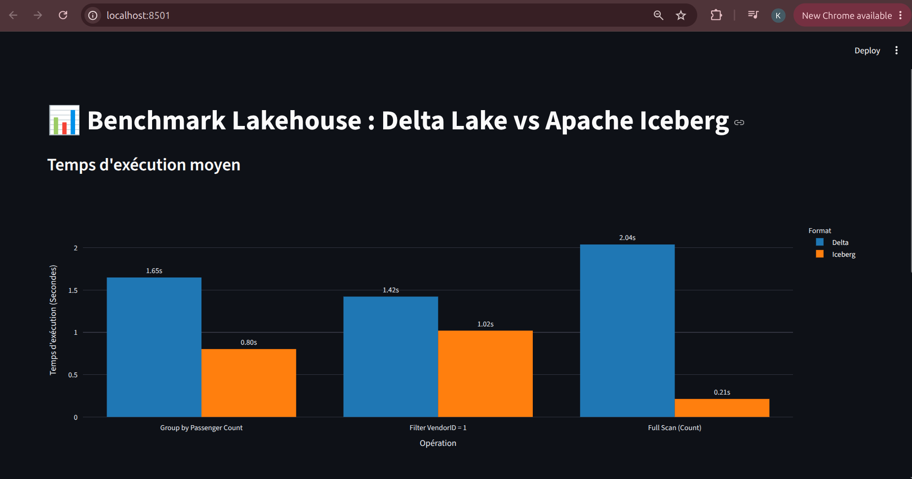

**Interprétation :** Apache Iceberg (orange) domine les trois charges de *lecture* :

| Opération | Delta (moy.) | Iceberg (moy.) | Gain Iceberg |
|---|---|---|---|
| Full Scan (Count) | 8.74 s | 0.46 s | **19.0×** |
| Filter VendorID = 1 | 2.33 s | 1.26 s | 1.8× |
| Group by Passenger Count | 4.48 s | 1.58 s | 2.8× |

### 2. Détail des Exécutions (Effet "Cold Start" vs "Warm Cache")
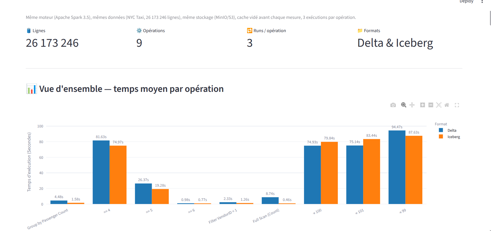

**Interprétation du tableau détaillé :**
Le tableau croisé du Streamlit permet d'analyser le comportement "à froid" (Run 1) et avec cache (Runs 2 et 3) :

1. **Full Scan (Count)** :
   - *Cold Start (Run 1)* : Delta prend **23.90 s** contre seulement **1.04 s** pour Iceberg. L'architecture d'Iceberg repose sur des `manifests` listant explicitement les chemins des fichiers Parquet : elle contourne le coûteux listing de répertoires sur stockage objet que Delta subit de plein fouet au premier accès.
   - *Warm (Runs 2 & 3)* : les temps chutent fortement (Delta ~1.2 s, Iceberg ~0.17 s) mais Iceberg reste structurellement plus rapide pour résoudre ses métadonnées.

2. **Filtre (Filter VendorID = 1)** : Iceberg l'emporte sur les 3 runs (Run 1 : **2.94 s** vs **4.47 s**). Ses statistiques min/max au niveau fichier permettent un *data skipping* (pruning) plus agressif.

3. **Agrégation (Group by Passenger Count)** : Iceberg systématiquement devant (Run 1 : **2.79 s** vs **10.07 s**), grâce à un scan ciblé des fichiers/colonnes utiles avant le *shuffle*.

### 3. Écritures ACID (UPDATE / DELETE)

Toujours sur les 26,17 M de lignes, avec modification réelle des données à chaque run :

- **UPDATE** — remplacer `payment_type` par `99 / 100 / 101` sur les **20 925 119 lignes** où `VendorID = 2` :
  - Résultats très proches (écriture = réécriture de datatiles + commit), Iceberg 87.63 s vs Delta 94.47 s sur le Run 1 (→ 99) ; Delta légèrement devant sur les Runs 2 et 3 (→ 100 / → 101).
- **DELETE** — supprimer les lignes `payment_type = 4 / 5 / 6` (33 299, puis 2, puis 0 lignes) : Iceberg plus rapide sur les trois runs (ex. Run 1 : **74.97 s** vs **81.63 s**).

**Conclusion :** Apache Iceberg se révèle nettement plus optimisé pour les **charges de lecture analytique** sur stockage objet (avance jusqu'à 19× sur le full scan), et reste globalement devant sur l'écriture ACID, tandis que Delta Lake reste compétitif sur les `UPDATE` à forte volumétrie. Le choix dépend donc du profil de charge dominant.

## 🛠️ Dépannage

### Erreur : Spark ne démarre pas
```bash
# Vérifier les logs
sudo docker compose logs spark-master
```

### Erreur : Permissions manquantes
```bash
# S'assurer que l'utilisateur a les droits sudo
sudo chown -R $USER:$USER ./
```

### Erreur : Données introuvables
```bash
# Vérifier que le bucket existe dans MinIO
http://localhost:9090

# Reconstruire les données
sudo docker compose down
sudo rm -rf data/
sudo docker compose up --build -d
sudo docker exec -it spark-master \
    spark-submit /opt/bitnami/spark/jobs/ingestion.py
```

### Erreur : Erreur de connexion S3
```bash
# Vérifier les logs MinIO
sudo docker compose logs minio

# Vérifier les configurations dans spark_jobs/ingestion.py
```

## 📂 Structure du Projet Détaillée

### infrastructure/

**docker-compose.yml**
```yaml
services:
  minio:
    image: bitnamilegacy/minio:2025.7.23-debian-12-r5
    environment:
      - MINIO_ROOT_USER=admin
      - MINIO_ROOT_PASSWORD=password
    volumes:
      - ../data/minio:/data

  spark-master:
    build:
      context: .
      dockerfile: Dockerfile
    environment:
      - SPARK_MODE=master
    volumes:
      - ../spark_jobs:/opt/bitnami/spark/jobs
      - ../data:/opt/bitnami/spark/data

  spark-worker:
    build:
      context: .
      dockerfile: Dockerfile
    environment:
      - SPARK_MODE=worker
      - SPARK_MASTER_URL=spark://spark-master:7077
    depends_on:
      - spark-master
    volumes:
      - ../spark_jobs:/opt/bitnami/spark/jobs
      - ../data:/opt/bitnami/spark/data
```

**Dockerfile**
```dockerfile
FROM bitnamilegacy/spark:3.5.0

USER root

# Installation des outils
RUN apt-get update && \
    apt-get install -y python3-pip curl && \
    rm -rf /var/lib/apt/lists/*

# Installation des dépendances Python
COPY requirements.txt /tmp/
RUN pip3 install --no-cache-dir -r /tmp/requirements.txt

# Installation des JARs Delta Lake et Iceberg
RUN cd /opt/bitnami/spark/jars/ && \
    curl -O https://repo1.maven.org/maven2/org/apache/hadoop/hadoop-aws/3.3.4/hadoop-aws-3.3.4.jar && \
    curl -O https://repo1.maven.org/maven2/com/amazonaws/aws-java-sdk-bundle/1.12.262/aws-java-sdk-bundle-1.12.262.jar && \
    curl -O https://repo1.maven.org/maven2/io/delta/delta-spark_2.12/3.1.0/delta-spark_2.12-3.1.0.jar && \
    curl -O https://repo1.maven.org/maven2/io/delta/delta-storage/3.1.0/delta-storage-3.1.0.jar && \
    curl -O https://repo1.maven.org/maven2/org/apache/iceberg/iceberg-spark-runtime-3.5_2.12/1.5.0/iceberg-spark-runtime-3.5_2.12-1.5.0.jar

# Retour à l'utilisateur non-root
USER 1001
```

## 📸 Galerie / Captures d'écran


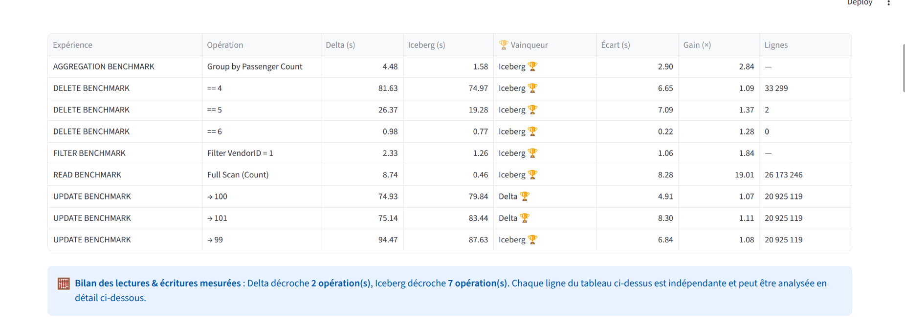
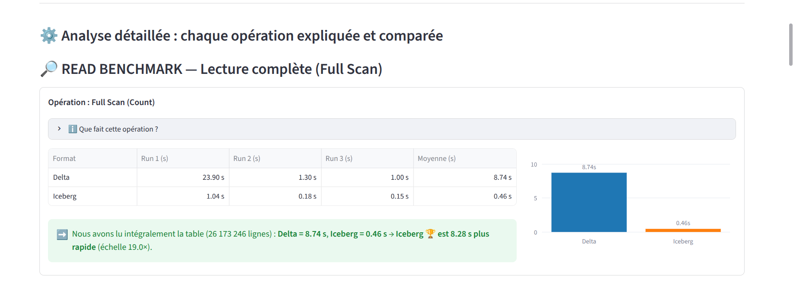
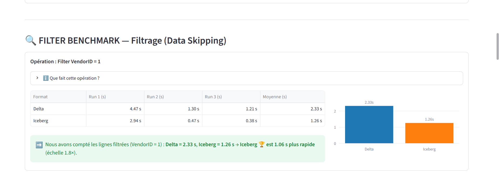
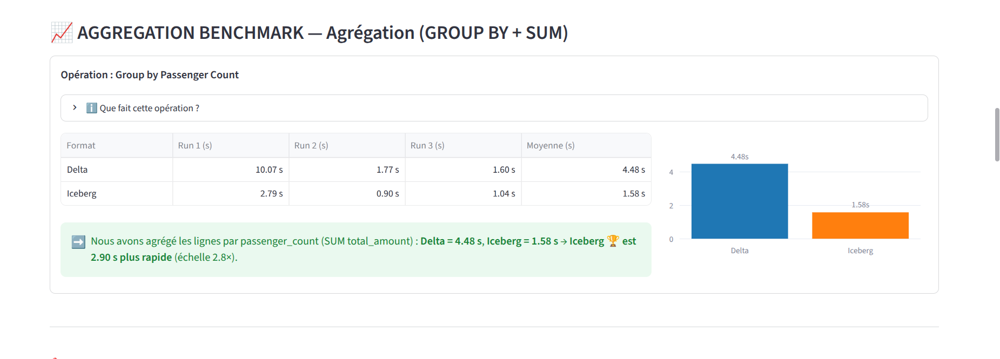
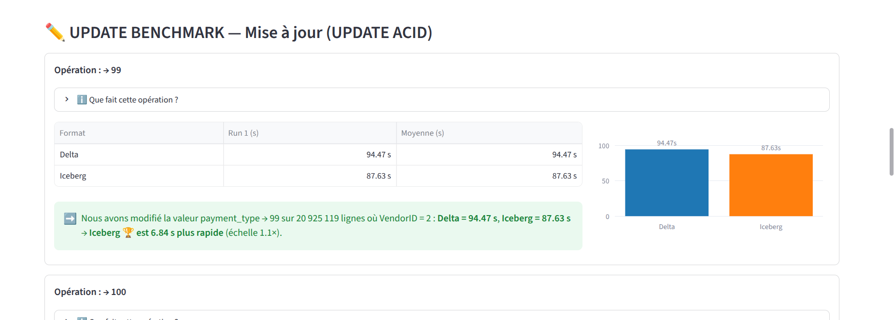
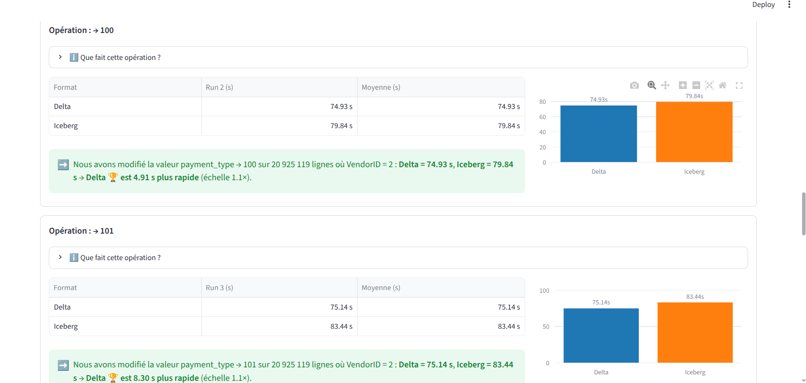
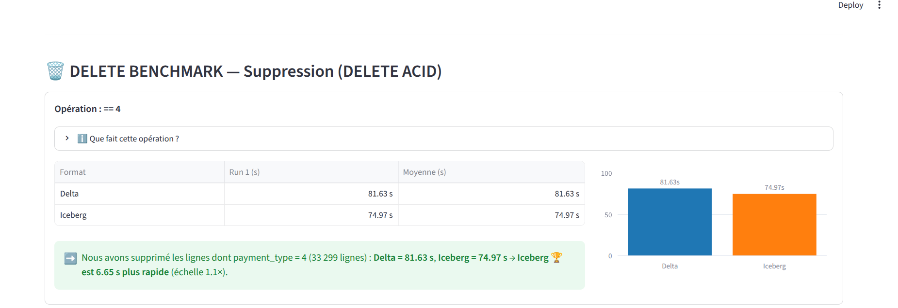
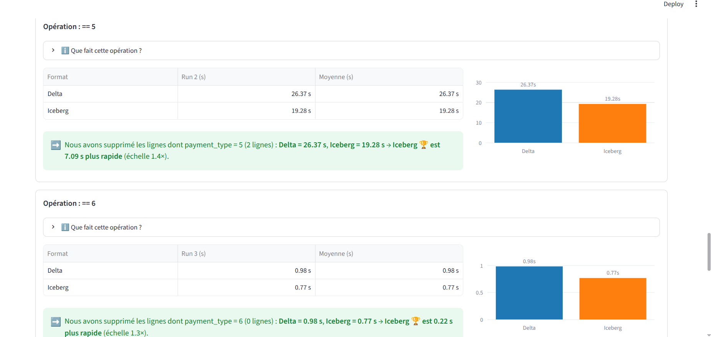
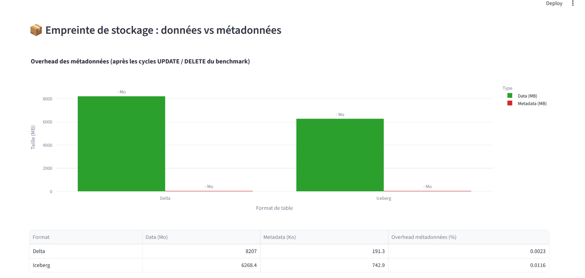
